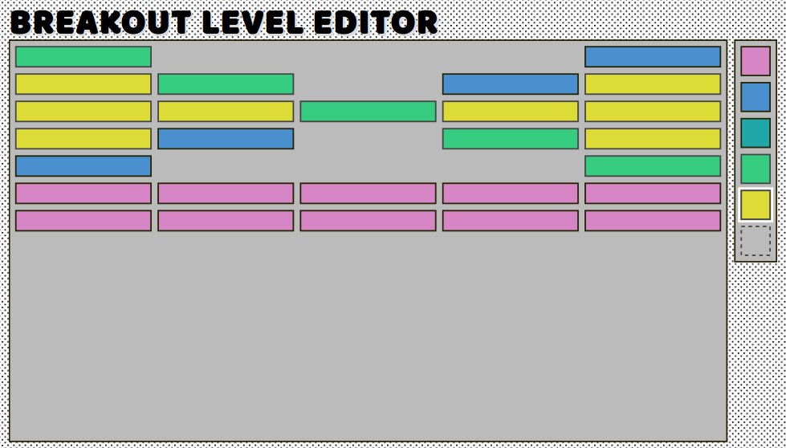

# Breakout

The classic game Breakout, implemented in ClojureScript using re-frame.

Currently only the level editor is implemented.

As seen on [Lambda Island](https://lambdaisland.com).

You can try [the demo](https://lambdaisland.github.io/breakout/) on-line

[](https://lambdaisland.github.io/breakout/)

## Development Mode

### Start Cider from Emacs:

Put this in your Emacs config file:

```
(setq cider-cljs-lein-repl "(do (use 'figwheel-sidecar.repl-api) (start-figwheel!) (cljs-repl))")
```

Navigate to a clojurescript file and start a figwheel REPL with `cider-jack-in-clojurescript` or (`C-c M-J`)

### Compile css:

Compile css file once.

```
lein garden once
```

Automatically recompile css file on change.

```
lein garden auto
```

### Run application:

```
lein clean
lein figwheel dev
```

Figwheel will automatically push cljs changes to the browser.

Wait a bit, then browse to [http://localhost:3449](http://localhost:3449).

## Production Build


To compile clojurescript to javascript:

```
lein clean
lein cljsbuild once min
```

## License

Copyright &copy; Arne Brasseur 2016

Distributed under the Mozilla Public License 2.0.
